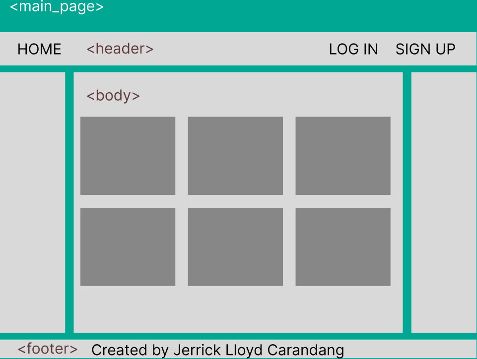
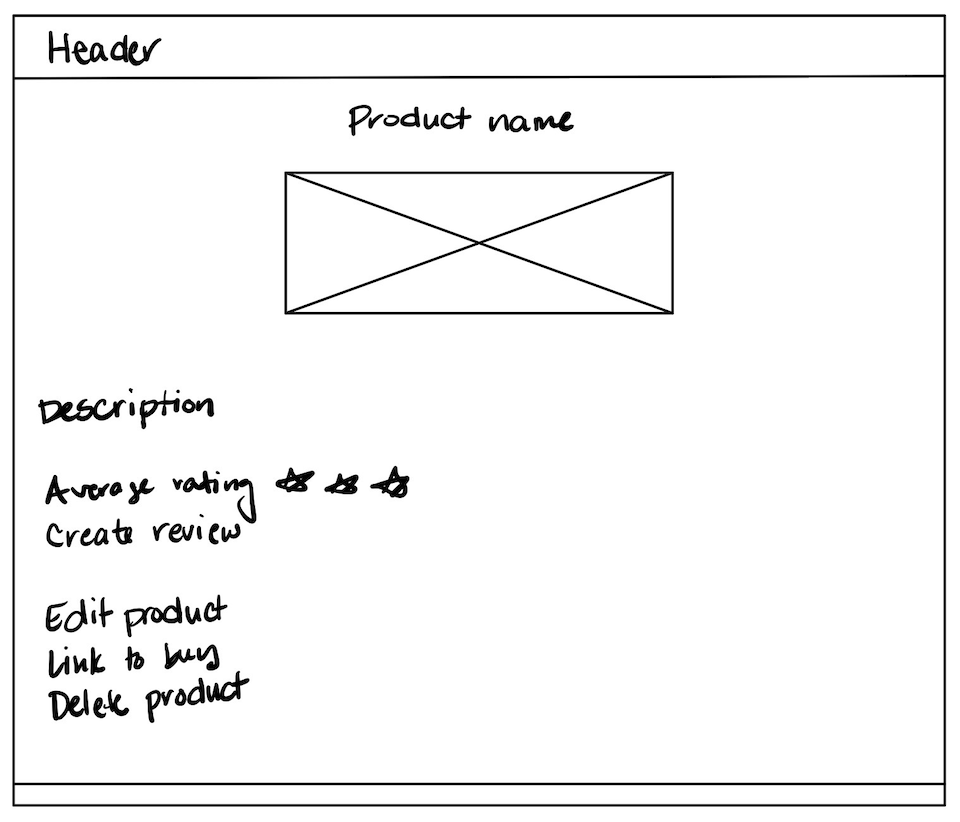
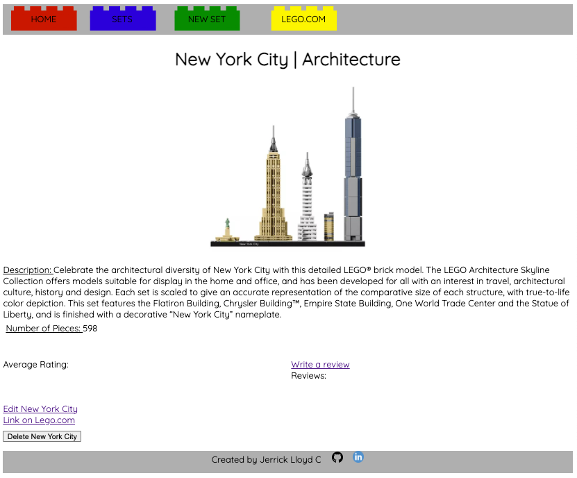
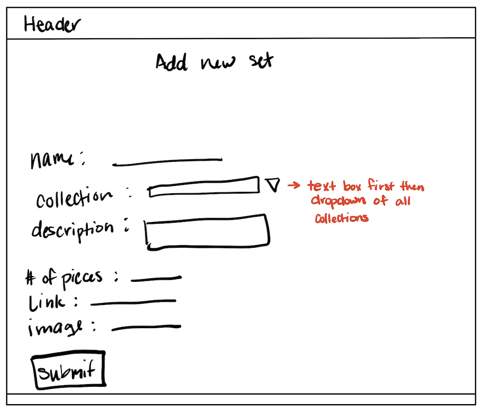
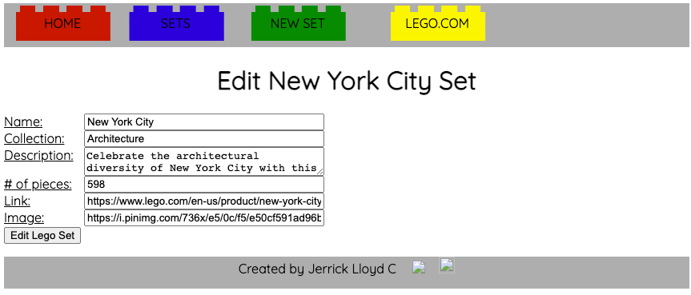

<h1>Get Your Brick On</h1>
<p>The purpose of this site is to rate and review Lego sets by using CRUD to create, read, update and delete Lego sets and review posts</p>

<h2>Wireframe</h2>
<h3>Lego Set Page</h3>

 {width: 600px; height: 300px; }

<h3>Show individual product</h3>

 {width: 600px; height: 300px; }
 {width: 600px; height: 300px; }

<h3>Edit individual product</h3>

 {width: 600px; height: 300px; }
 {width: 600px; height: 300px; }

<h2>Organization</h2>
There are two main scetions of the site: A Product section to display collections of Lego sets and a Review section to post reviews and ratings about the lego set. 

The project is organized by the MVC format. In the project, you will find it divided into three folders: 

<h3>Models</h3>
There are three models.js files.
<ul>
<li>db.js - For the database</li>
<li>products.js - For the Product information</li>
<li>reviews.js - For the Reviews </li>
</ul>
The table below is how the products and reviews schemas are set up 

|     products    |     reviews    |
|-----------------|----------------|
|   Name of set   |  Name of set   |
|    Name of the collection        |
|   Description   |    content     |
| Number of pieces|     Rating     |
|      Link       |      Link      |

The Name of the set and the theme/collection along with the link are shared information that is currently separated. 

<h3>Views</h3>
The views section is divided into four (4) folders 
```json
views
├── home
│   ├── Home.jsx
├── layouts
│   ├── Default.jsx
│   ├── Productlayout.jsx
├── legoset
│   ├── Editproducts.jsx
│   ├── Indexproducts.jsx
│   ├── Newproducts.jsx
│   └── Showproducts.jsx
├── reviews
│   ├── EditReview.jsx
│   ├── IndexReview.jsx
│   ├── NewReview.jsx
│   └── ShowReview.jsx
```

<h3>Controllers</h3>

The controller folder is divided into three sections: Data, Route, Views files for the Products, a Data file for Reviews and an authentication file. The setsRouteCtrl acts the main route for the app.


<h2>CRUD</h2>
<h3>Creating</h3>
<h4>Adding a new Lego Set</h4>
Users have the ability to add any Lego set by clicking the "New Set" link in the header. The user will then be ability to enter the necessary information.
For now, the user can input the collection name but the end goal is to provide a dropdown of the name of all the Lego collections
.
<h3>Read</h3>
<h4>Reading a Lego Set</h4>

<h3>Updating</h3>
<h4>Updating an existing Lego Set</h4>

<h3>Delete</h3>
<h4>Deleting a Lego Set</h4>

<h2>Ice Box Features</h2>
<ul>
<li>Add an API to display more sets</li>
<li>Create a wishlist</li>
<li>Add more online stores where the user can buy the product via Amazon, Walmart, etc</li>
</ul>

<h2>Etc...</h2>
<h3>Trello</h3>
https://trello.com/b/NyWmJcSP/ga-project-2
<h3>Drawings!</h3>
For the links in the header, I decided to draw out the bricks and set them as the buttons background to give it a nice aethetic touch. 

<!-- Restful route table -->

<!-- | Action |       URL      | HTTP Verb | JSX View |     Mongoose Method      |
|--------|----------------|-----------|----------|--------------------------|
| Index  |    /review/    |  GET      |Index.jsx |       Review.find()      |
|  Show  | /review/:id    |  GET      | Show.jsx |      Review.findById()   |
|   New  | /review/new    |  GET      | New.jsx  |           none           |
|Create  |    /review/    |  POST     |   none   |  Review.create(req.body) |
|  Edit  |/review/:id/edit|  GET      | Edit.jsx |      Review.findById()   |
|Update  | /review/:id    |  PUT      |  none    |Review.findByIdAndUpdate()|
|Delete  |    /review/    |  DELETE   |  none    |Review.findByIdAndDelete()|   -->
